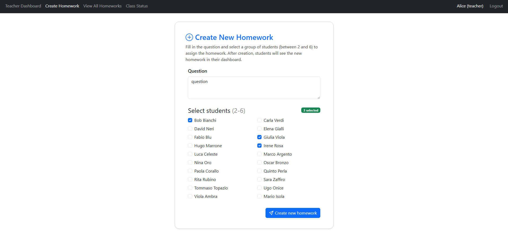
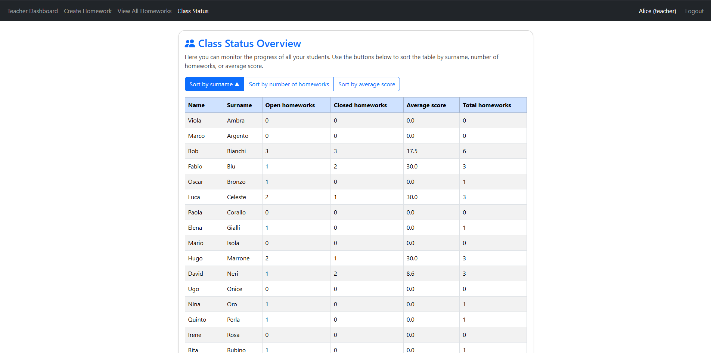

[](https://classroom.github.com/a/F9jR7G97)
# Exam #2: "Compiti"
## Student:  Labate Antonino 

## React Client Application Routes


- Route `/`  
  **Purpose:** Entry point. Redirects to `/login` if not authenticated, otherwise redirects to the appropriate dashboard (`/teachers` or `/students`) based on user role.

- Route `/login`  
  **Purpose:** Login page for all users (teachers and students).

- Route `/teachers`  
  **Purpose:** Teacher dashboard welcome page.  
  **Access:** Only for users with role `teacher`.

- Route `/teachers/homework`  
  **Purpose:** Page for teachers to create a new homework assignment.  
  **Access:** Only for users with role `teacher`.

- Route `/teachers/homeworks`  
  **Purpose:** Page for teachers to view, manage, and grade all assigned homeworks.  
  **Access:** Only for users with role `teacher`.

- Route `/teachers/classStatus`  
  **Purpose:** Page for teachers to monitor class status and student progress.  
  **Access:** Only for users with role `teacher`.

- Route `/students`  
  **Purpose:** Student dashboard welcome page.  
  **Access:** Only for users with role `student`.

- Route `/students/homeworks`  
  **Purpose:** Page for students to view open homeworks assigned to them.   
  **Access:** Only for users with role `student`.
- Route `/students/homeworks/:id`  
  **Purpose:** Page for students to answer a specific homework.  
  **Access:** Only for users with role `student`.

- Route `/students/stats`  
  **Purpose:** Page for students to view closed homeworks and their average score.  
  **Access:** Only for users with role `student`.

- Route `*`  
  **Purpose:** Catch-all. Redirects to `/login` for any undefined route.


## API Server


### __Create a new homework__

URL: `/api/homeworks`  
HTTP Method: POST  
Description: Create a new homework by providing a question and a group of student IDs.  
Autorized roles:  `teacher`

Request body:
```
{
  "question": "What is 2+2?",
  "studentIds": [2, 4, 6]
}
```
Response: `200 Created` (success), `422 Bad Request` (invalid group), or `500 Internal Server Error`.  
Response body: _None_

---
### __Get all homeworks__

URL: `/api/homeworks`  
HTTP Method: GET  
Description: Retrieve all homeworks.  
Autorized roles:  `teacher`

Response: `200 OK` (success), or `500 Internal Server Error`.  
Response body:
```
[
  {
    
    "id": 1,
    "question": "What is 2+2?",
    "answer": "4",
    "state": "open",
    "score": null,
    "fk_iduser": 1"
  },
  ...
]
```

---


### __Insert score to a homework__

URL: `/api/homeworks/<id>/score`  
HTTP Method: PATCH  
Description: Insert a score for the specified homework and mark it as closed.  
Autorized roles:  `teacher`

Request body:
```
{
  "score": 28
  
}
```
Response: `200 OK` (success), `404 Not Found` (invalid ID), `409 Conflict` (homework already closed), `422 Unprocessable Entity` (validation error), or `500 Internal Server Error`.
Response body: _None_

---

### __Get class status__

URL: `/api/students/stats`  
HTTP Method: GET  
Description: Returns statistics for each student, including number of open homeworks, number of closed homeworks, and weighted average score.  
Autorized roles:  `teacher`

Response: `200 OK` (success), or `500 Internal Server Error`.  
Response body:
```
[
  {
    "name": "Alice",
    "surname": "Rossi",
    "openHomeworks": 7,
    "closedHomeworks": 3,
    "averageScore": 26.5
  },
  ...
]
```

---

### __Get all students__

URL: `/api/students`  
HTTP Method: GET  
Description: Retrieve all students.  
Autorized roles:  `teacher`

Response: `200 OK` (success), or `500 Internal Server Error`.  
Response body:
```
[
  {
    "id": 1,
    "name": "Alice",
    "surname": "Rossi",
    "mail": "alice@mail.it"
  },
  ...
]
```

---

### __Get all open homeworks of a student__

URL: `/api/students/<id>/homeworks`  
HTTP Method: GET  
Description: Retrieve all open homeworks the authenticated student is part of.  
autorized roles:  `student`
Response: `200 OK` (success) ,  `422 Unprocessable Entity` (validation error), or `500 Internal Server Error`.
Response body:
```
[
  {
    "id": 1,
    "question": "What color is the sky?",
    "answer": "blue",
    "teacherName": "alice",
    "teacherSurname": "rossi"
  },
    
  ...
]
```

---

### __Update the answer to a homework__

URL: `/api/homeworks/<id>/answer`  
HTTP Method: PATCH  
Description: Update the answer to a homework. Only allowed if the homework is still open and the student is part of the group.  
autorized roles:  `student`
Request body:
```
{
  "answer": "the sky is blue"
}
```
Response: `200 OK` (success), , `409 Conflict` (homework is closed), `422 Unprocessable Entity` (validation error), or `500 Internal Server Error`.
Response body: _None_

---

### __Get student statistics for  all closed homeworks of a student__

URL: `/api/students/<id>/stats`
HTTP Method: GET  
Description: Get scores and average for the authenticated student with id `<id>`.
autorized roles:  `student`

Response: `200 OK` (success),  `422 Unprocessable Entity` (validation error), or `500 Internal Server Error`.

Response body:
```
{
  "closed_homeworks": [
    {
      
      "question": "what color is the sky?",
      "answer": "Blue ",
      "score": 29
    },
    ...
  ],
  "average": 27.3
}
```


## Database Tables


### `USER` table

| Field | Type |
| :-- | :-- |
| id | integer |
| name | text |
| surname | text |
| mail | text |
| role | text |
| password | text |
| salt | text |


---

### `HOMEWORK` table

| Field | Type |
| :-- | :-- |
| id | integer |
| question | text |
| answer | text |
| state | text |
| score | integer |
| fk_iduser | integer (references `USER`) |


---

### `STUDENT_HOMEWORK` table

| Field | Type |
| :-- | :-- |
| id | integer |
| fk_user | integer (references `USER`) |
| fk_homework | integer (references `HOMEWORK`) |


---


## Main React Components


- `App` (in `App.jsx`):  
  Main application component. Handles routing, authentication state, and renders the correct layout and pages based on user role.

- `Layout` (in `components/Layout.jsx`):  
  Wrapper component that displays the navigation bar and the main page content.

- `Navbar` (in `components/Navbar.jsx`):  
  Top navigation bar. Shows navigation links based on user role and manages logout with a confirmation modal.

- `LoginForm` (in `components/LoginForm.jsx`):  
  Login form for both teachers and students.

- `TeacherDashboard` (in `components/teacher_components/TeacherDashboard.jsx`):  
  Welcome page for teachers with quick links to main teacher functionalities.

- `CreateHomeworkForm` (in `components/teacher_components/CreateHomeworkForm.jsx`):  
  Page for teachers to create and assign new homework to students.

- `ViewHomeworks` (in `components/teacher_components/ViewHomeworks.jsx`):  
  Page for teachers to view, manage, and grade all assigned homeworks.

- `ClassStatus` (in `components/teacher_components/ClassStatus.jsx`):  
  Page for teachers to monitor the status and progress of all students.

- `StudentDashboard` (in `components/student_components/StudentDashboard.jsx`):  
  Welcome page for students with quick links to main student functionalities.

- `ViewOpenHomeworks` (in `components/student_components/ViewOpenHomeworks.jsx`):  
  Page for students to view open homeworks assigned to them.

- `ViewClosedHomeworks` (in `components/student_components/ViewClosedHomework.jsx`):  
  Page for students to review closed homeworks and see their average score.

- `HomeworkAnswerForm` (in `components/student_components/HomeworkAnswerForm.jsx`):  
  Page for students to answer a specific homework.

## Screenshot
### Create Homework Page


### Class Status Page  



## Users Credentials
password: password

Students:

- bob2@mail.it 
- carla3@mail.it
- david4@mail.it 
- elena5@mail.it
- fabio6@mail.it 
- giulia7@mail.it 
- hugo8@mail.it 
- irene9@mail.it
- luca10@mail.it 
- marco11@mail.it
- marioisola@mail.it 
- nina12@mail.it 
- oscar13@mail.it 
- paola14@mail.it 
- quinto15@mail.it
- rita16@mail.it 
- sara17@mail.it 
- tommaso18@mail.it 
- ugo19@mail.it 
- viola20@mail.it 

Teachers:

- alice1@mail.it 
- profa@mail.it 
- profb@mail.it
- profc@mail.it 
- profd@mail.it 
- profe@mail.it 
